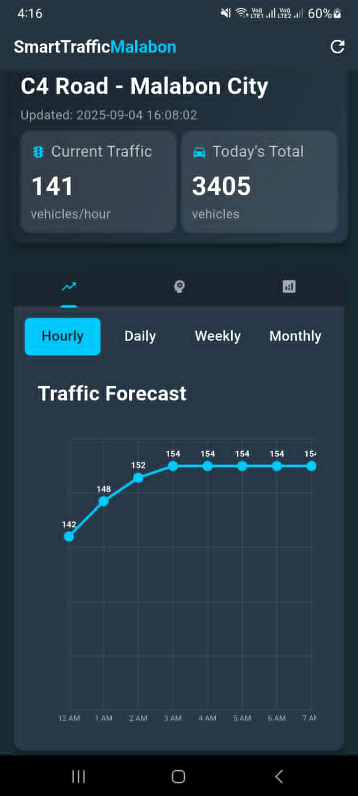

# C4 Road Traffic Prediction App

A comprehensive Flutter application for real-time traffic prediction and analysis on C4 Road, Malabon City. This app provides live traffic forecasts, intelligent recommendations, and interactive visualizations to help users navigate traffic efficiently.

## Screenshot

  

✨ New Look

## Features

### 🚗 **Real-Time Traffic Analytics**
- **Live Prediction Summary**: Today's traffic overview with peak/low hours and vehicle counts
- **Weekly Analytics**: Current week traffic patterns and averages
- **Quarterly Insights**: Three-month traffic trends and projections

### 📊 **Interactive Data Visualization**
- **Scrollable Charts**: Navigate through 24-hour daily patterns and 12-month yearly trends
- **Responsive Design**: Enhanced chart sizing for landscape mode viewing
- **Time Formats**: User-friendly AM/PM time display instead of 24-hour format
- **Actual Dates**: Weekly view shows real dates instead of generic week numbers

### 🎯 **Smart Traffic Recommendations**
- **Tabbed Interface**: Separate tabs for General and Custom Prediction recommendations
- **Modern Card Design**: Enhanced cards with gradient backgrounds and smart categorization
- **Intelligent Classification**: Auto-categorizes recommendations by type (Peak Hours, Route, Timing, Low Traffic, etc.)
- **Custom Predictions**: Interactive date/time selector for personalized traffic forecasts
- **Real-Time API Integration**: Dynamic recommendations based on current traffic patterns

### 🎨 **Enhanced User Experience**
- **Modern Three-Tab Navigation**: Forecast, Custom Prediction, and Summary tabs
- **Professional UI**: Dark theme with gradient backgrounds and consistent Material Design
- **Touch-Optimized**: Responsive buttons with reduced padding for better text display
- **Smooth Interactions**: Pull-to-refresh functionality with loading states
- **Overflow Prevention**: Proper layout management for all screen sizes
- **Enhanced Charts**: Smaller forecast graphs with grey grid lines for better readability

## Technology Stack

- **Frontend**: Flutter with Material Design
- **Backend**: FastAPI deployed on Railway
- **Data Sources**: 
  - Live traffic prediction API
  - Real-time analytics endpoint
  - Dynamic recommendation system
- **Visualization**: Custom `CustomPainter` with scrollable charts
- **Architecture**: REST API integration with Future-based state management

## API Endpoints

- **Traffic Predictions**: `/api/dashboard/user/end-user-prediction-detail`
- **Analytics Summary**: `/api/dashboard/user/end-user-prediction-summary`  
- **General Recommendations**: `/api/dashboard/user/end-user-traffic-recommendations`
- **Custom Predictions**: `/predict-for-datetime` (POST with datetime parameters)
- **Custom Recommendations**: `/recommend-for-datetime` (POST with datetime parameters)

## Development

This project showcases modern mobile development practices:
- **AI-Assisted Development**: Built with **Claude Sonnet 4** in VS Code
- **Educational Tools**: Leveraged **GitHub Education** benefits
- **Real-World Integration**: Live API consumption and data visualization
- **Responsive Design**: Adaptive UI for multiple orientations and screen sizes

## Getting Started

1. **Prerequisites**: Flutter SDK, Android Studio/VS Code
2. **Dependencies**: All required packages are listed in `pubspec.yaml`
3. **API Access**: The app connects to live FastAPI endpoints on Railway
4. **Build**: Standard Flutter build process for Android/iOS

For Flutter development help, visit the [official documentation](https://docs.flutter.dev/).

## Color Scheme

- **Background**: `#192A31` (Dark blue-green)
- **Cards**: `#293949` (Medium gray-blue)  
- **Highlights**: `#00C8FA` (Bright cyan)
- **Secondary**: `#586A80` (Muted gray-blue)
- **Gradients**: Various opacity levels for modern card designs
- **Category Colors**: Smart color coding for recommendation types (Red for Peak Hours, Orange for Routes, Gold for Timing, Green for Low Traffic)

## Recent Updates

### Latest Features ✨
- **Redesigned Traffic Summary**: Modern card-based layout with gradients and better spacing
- **Enhanced Custom Predictions**: Interactive datetime picker with real-time API integration
- **Smart Recommendation Cards**: Auto-categorized recommendations with type-specific icons and colors
- **Improved Chart Display**: Optimized sizing and grid lines for better data visualization
- **Tabbed Recommendations**: Separate sections for General and Custom Prediction recommendations
- **UI Consistency**: Standardized modern design language across all components

---

**Live Traffic Intelligence for Smart Navigation** 🚦📱
