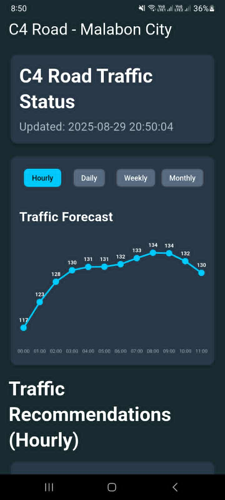

# C4 Road Traffic Prediction App

A Flutter application for predicting traffic patterns on C4 Road, Malabon City. This app provides hourly, daily, weekly, and monthly traffic forecasts with visual line charts and traffic recommendations.

## Screenshot

  

## Features

- **Traffic Forecasting**: View traffic predictions across different time periods
- **Interactive Line Charts**: Visual representation of traffic data with custom styling
- **Time Period Selection**: Switch between Hourly, Daily, Weekly, and Monthly views
- **Traffic Recommendations**: Get context-aware recommendations based on traffic patterns
- **Responsive Design**: Optimized for both portrait and landscape orientations
- **Custom Color Scheme**: Dark theme with professional color palette

## Technology Stack

- **Framework**: Flutter
- **Data Format**: JSON (static assets) (will use FastAPI soon)
- **Charts**: Custom `CustomPainter` implementation
- **Theme**: Material Design with custom color scheme

## Development

This project was developed with **Claude Sonnet 4** in VS Code with **GitHub Education** benefits, demonstrating the power of AI-assisted development in creating sophisticated mobile applications.

## Getting Started

This project is a starting point for a Flutter application focused on traffic prediction and analysis.

For help getting started with Flutter development, view the
[online documentation](https://docs.flutter.dev/), which offers tutorials,
samples, guidance on mobile development, and a full API reference.

## Color Scheme

- Background: `#192A31`
- Cards: `#293949`
- Highlights: `#00C8FA`
- Unselected Elements: `#586A80`
